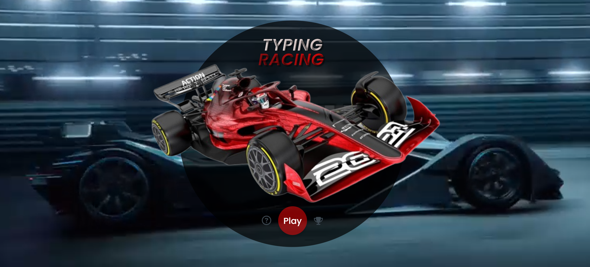

# Typing Racing



Typing Racing is a video game created to practice and showcase skills learned in `HTML`, `CSS`, and `JavaScript`.

## Instructions to use the Video Game

1. Go to the [webpage](https://fabianmendozaospina.github.io/typing-racing/) of the video game 
2. Press "Play" button, wait for the start signal
3. Type the words as quickly as possible
4. To win, type all the words before the timer runs out
5. Correct answers appear as "Hits"
6. Upon finalizing a game you can see your score through the icon `trophy`

## Technological Stack
<p>
    &nbsp;
    &nbsp;
    &nbsp;
</p>

## Get Started

To get started locally:

1. Clone this repo:
   ```bash
   git clone https://github.com/fabianmendozaospina/typing-racing
   cd typing-racing
   ```
2. Explore the index.html in the root and the different files contained in their folders:
    - assets
        - audio
        - data
        - css
        - img
        - js
        - video